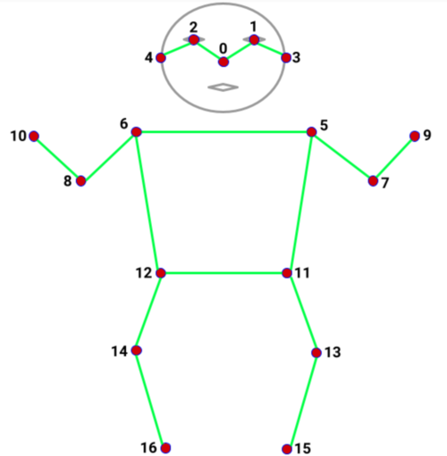

# BodyForController
You use your body to control where you go and actions to take. First game to test on is Minecraft.  
In the future I'll make this customizable for every game and make it easier for the user to pick and customize keybinds.  
For now I'll focus on shipping a prototype.  

```
KEYPOINT_DICT = {
    'nose': 0,
    'left_eye': 1,
    'right_eye': 2,
    'left_ear': 3,
    'right_ear': 4,
    'left_shoulder': 5,
    'right_shoulder': 6,
    'left_elbow': 7,
    'right_elbow': 8,
    'left_wrist': 9,
    'right_wrist': 10,
    'left_hip': 11,
    'right_hip': 12,
    'left_knee': 13,
    'right_knee': 14,
    'left_ankle': 15,
    'right_ankle': 16
}
```

  

TO DO:  
-[ ] Implement body/pose detection  
-[ ] Implement hand/fingers detection   
-[ ] Bundle the project into exe file  
